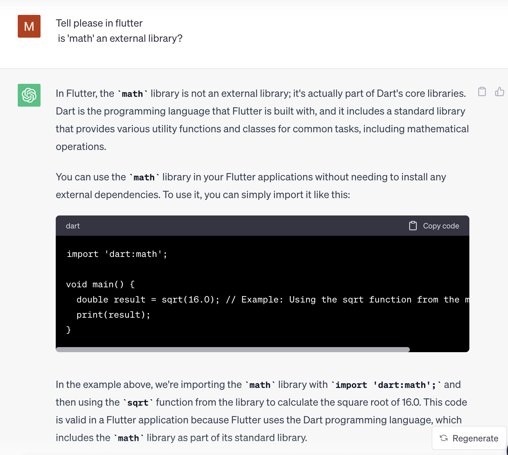
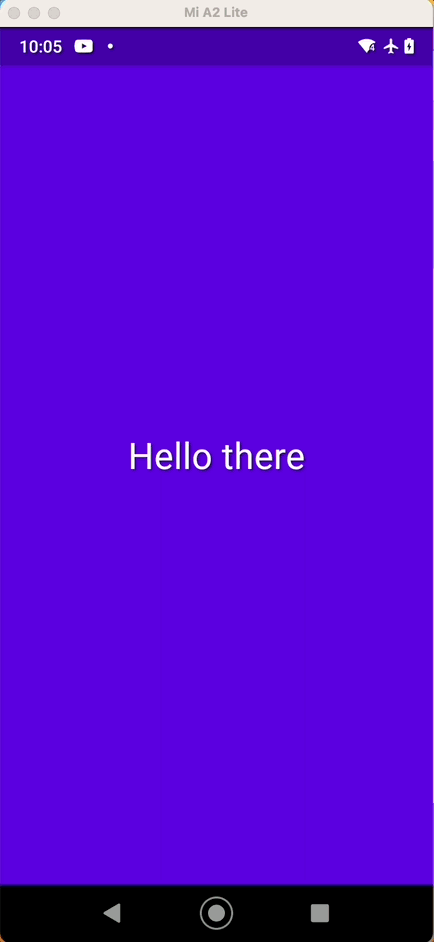
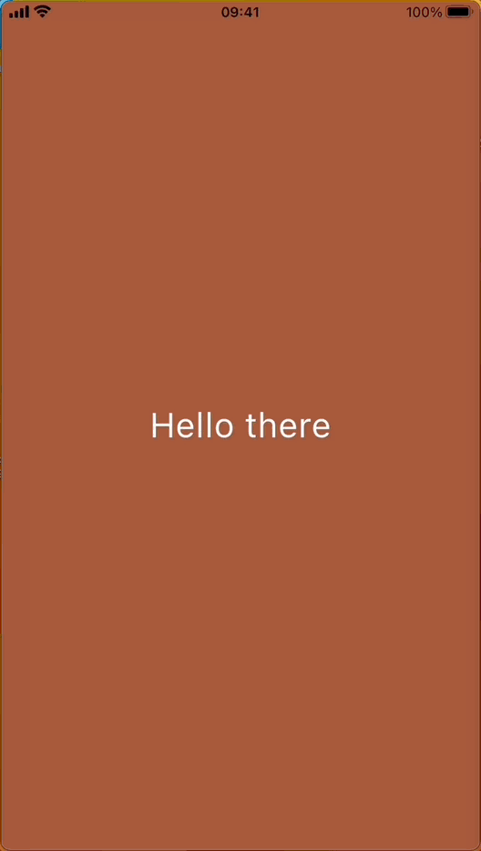
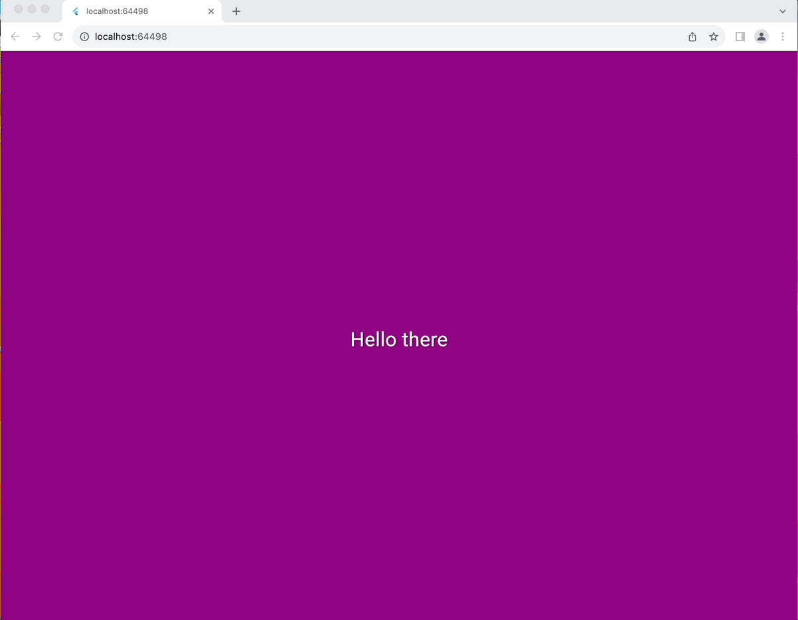

## Task:
 - The application should: display the text "Hello there" in the middle of the screen and after tapping anywhere on the screen, a background color should be changed to a randomly generated color. You can also add any other feature to the app 
 - Please do not use any external libraries for color generation
 - Use solid_lints (https://pub.dev/packages/solid_lints) to perform static code analysis and fix any issues.

## Additional feature that wasn't required in the task:
 - changed text color("Hello there") depends on background color. Purpose for that - to make text visible.

## Asking ChatGPT if I can use 'math' library for generating random color:

## Screens:

### Android:

    

### IOS:

    

### Web:

    

